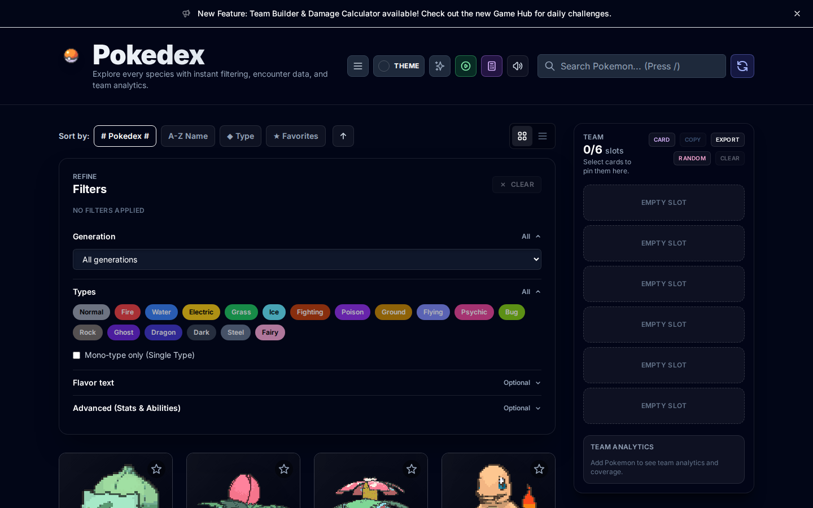
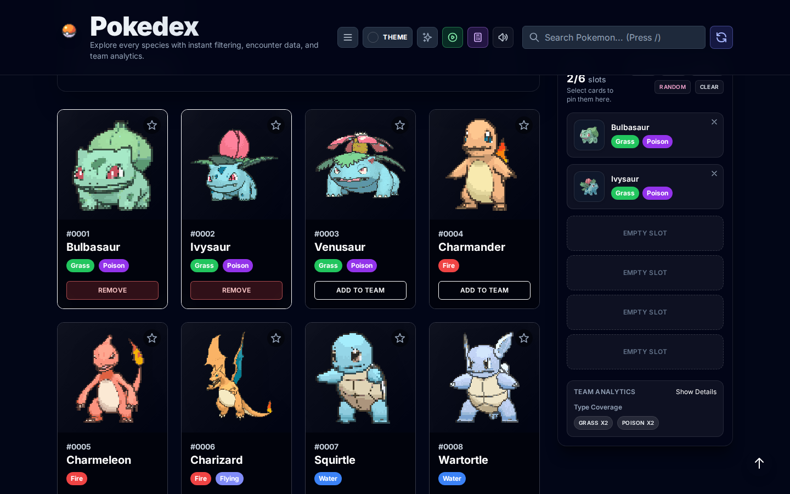
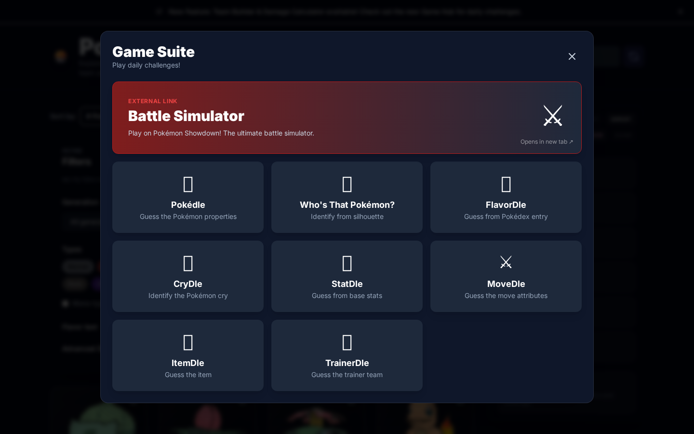
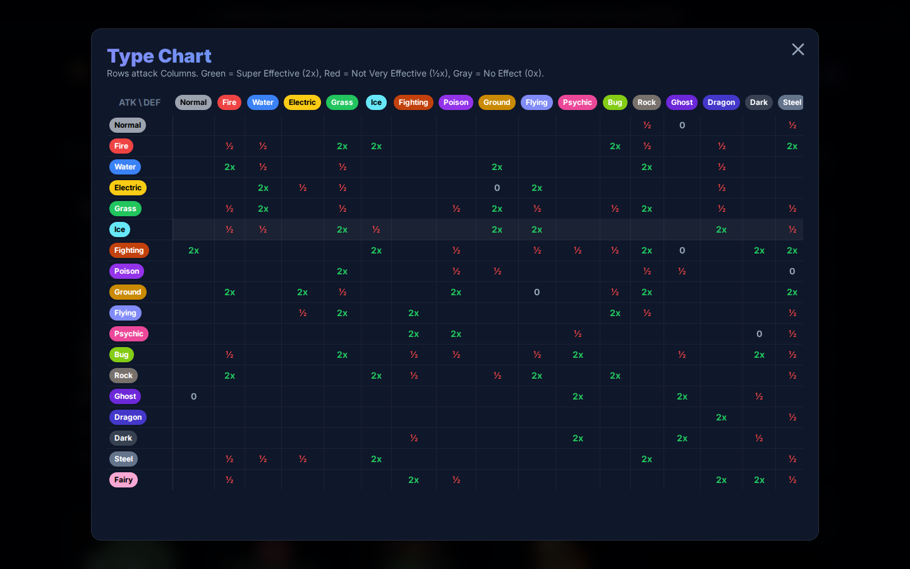

# Pokédex

[](https://react.dev/)
[](https://vitejs.dev/)
[](https://www.typescriptlang.org/)
[](https://web.dev/progressive-web-apps/)
[](https://opensource.org/licenses/MIT)

A modern Pokédex web app with team building, battle calculator, mini-games, and complete reference data.

**[🔴 Live Demo](https://pokedex-ten-sage.vercel.app/)**



## Features

### Core Pokédex

- **Search & Filter**: Find Pokémon by name, ID, type, generation, or base stat total
- **Detailed Views**: Stats, abilities, evolution chains, flavor text, and move sets
- **Shiny Sprites**: Toggle shiny mode globally with `Shift + S`
- **3D Card Effects**: Interactive tilt and parallax on hover
- **Audio**: Authentic Pokémon cries from PokeAPI (toggleable)
- **Favorites**: Star Pokémon to save them locally
- **Comparison**: Compare up to 4 Pokémon side-by-side


### Team Builder

- **6-Pokémon Teams**: Drag & drop interface for building teams
- **Type Coverage Analysis**: See your team's strengths and weaknesses instantly
- **Stats Radar**: Visualize average team stats
- **Import/Export**: Share teams in Showdown format via clipboard
- **Team Analytics**: Identify common vulnerabilities and resistances



### Battle Calculator

- **Advanced Damage Calculator**: Simulate battles with real stats
- **Customization**: Adjust EVs (0-252), IVs (0-31), natures, and held items
- **Move Selection**: Choose from actual move pools
- **Damage Ranges**: Visual health bar showing expected damage
- **Type Chart**: Interactive weakness/resistance calculator

### Daily Games

Test your knowledge with "dle" style challenges:

- **Pokédle**: Guess by type, stats, and color
- **Who's That Pokémon?**: Classic silhouette game
- **CryDle**: Identify by cry
- **FlavorDle**: Guess from Pokédex entries
- **StatDle**: Identify by base stats
- **MoveDle/ItemDle**: Expert challenges



### Reference Data

- **Type Chart**: Full type effectiveness matrix
- **Move Dex**: Searchable move database with power, accuracy, and effects
- **Ability Dex**: Complete ability descriptions
- **Item Dex**: All items with effects
- **Nature Chart**: Stat modifiers at a glance



## Tech Stack

- **Framework**: React 19 with Vite 6
- **Language**: TypeScript 5.8
- **Styling**: Tailwind CSS 3.4
- **State**: Zustand + React Query
- **Data**: PokeAPI GraphQL endpoint
- **Storage**: IndexedDB via idb-keyval
- **Testing**: Vitest + Playwright
- **PWA**: Offline support with vite-plugin-pwa

## Getting Started

### Prerequisites

- Node.js 20+ (specified in `.node-version`)
- npm 10+

### Installation

```bash
# Clone the repository
git clone https://github.com/yourusername/graphql-pokedex.git
cd graphql-pokedex

# Install dependencies
npm install

# Start dev server (http://localhost:5173)
npm run dev

# Build for production
npm run build

# Preview production build
npm run preview
```

### Available Scripts

```bash
npm run dev          # Start dev server
npm run build        # Build for production
npm run preview      # Preview production build
npm run test         # Run unit tests
npm run test:watch   # Run tests in watch mode
npm run typecheck    # TypeScript type checking
npm run check        # Full validation (types + tests + build)
npm run codegen      # Generate GraphQL types
```

## Project Structure

```
src/
├── components/       # UI components
│   ├── base/        # Reusable primitives (Button, Card, Badge, etc.)
│   ├── pokemon/     # Pokémon-specific (PokemonCard, DetailView, etc.)
│   ├── team/        # Team builder components
│   └── games/       # Daily game implementations
├── hooks/           # Custom React hooks
├── services/        # API integration and business logic
├── store/           # Zustand state management
├── types/           # TypeScript definitions
├── utils/           # Helper functions
└── workers/         # Web Workers for filtering
```

## Performance

- **Web Workers**: Offloads filtering to background threads
- **Virtual Scrolling**: Renders only visible cards
- **Code Splitting**: Route-based lazy loading
- **PWA Caching**: Offline-first with service worker
- **Memoization**: Optimized re-renders with React.memo and useMemo
- **IndexedDB**: Fast local persistence

## Accessibility

- **Keyboard Navigation**: Full keyboard support with shortcuts
- **WCAG 2.1 AA**: High contrast ratios and semantic HTML
- **ARIA Labels**: Screen reader compatible
- **Focus Management**: Clear focus indicators
- **Reduced Motion**: Respects `prefers-reduced-motion`

## Keyboard Shortcuts

| Key          | Action               |
| ------------ | -------------------- |
| `/`          | Focus search         |
| `Shift + S`  | Toggle shiny mode    |
| `Shift + T`  | Toggle theme         |
| `Escape`     | Close modal          |
| `Arrow Keys` | Navigate detail view |

## Browser Support

- Chrome/Edge 90+
- Firefox 88+
- Safari 14+
- Mobile browsers (iOS Safari, Chrome Android)

## Deployment

Deploy to Vercel, Netlify, or any static host:

```bash
npm run build
# Upload the dist/ folder
```

Environment variables (optional):

```bash
# .env.local
VITE_POKEAPI_GRAPHQL_URL=https://beta.pokeapi.co/graphql/v1beta
```

## Contributing

1. Fork the repository
2. Create a feature branch: `git checkout -b feature/your-change`
3. Commit changes: `git commit -m 'Add feature'`
4. Push to branch: `git push origin feature/your-change`
5. Open a Pull Request

Run checks before submitting:

```bash
npm run lint
npm run format
npm run check
```

## License

[MIT License](LICENSE)

## Acknowledgments

- Pokémon data from [PokeAPI](https://pokeapi.co/)
- Sprites and cries © The Pokémon Company
- Built with [React](https://react.dev/), [Vite](https://vitejs.dev/), and [Tailwind CSS](https://tailwindcss.com/)

---

**Note**: This is a fan project. Pokémon and all associated names are trademarks of Nintendo, Game Freak, and The Pokémon Company.
